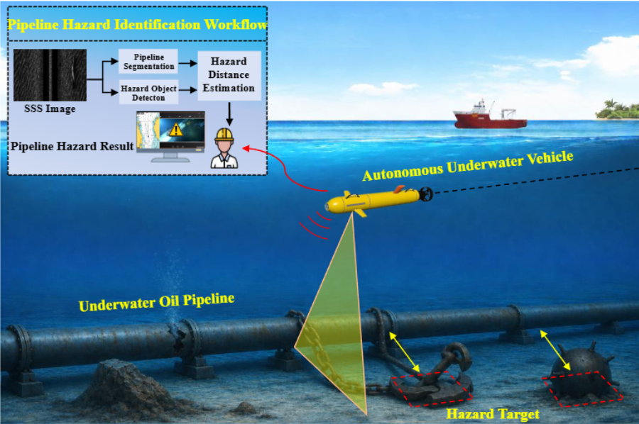
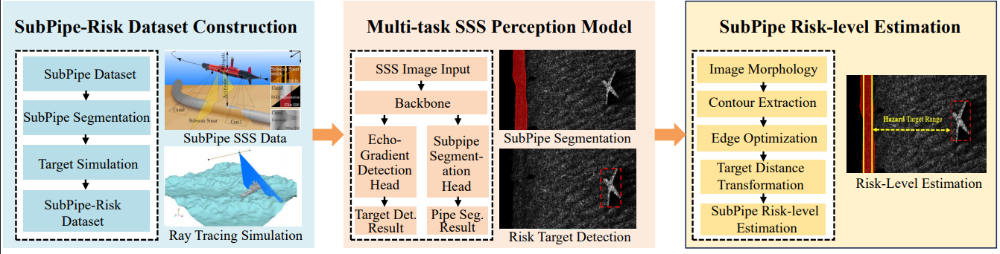

# SubPipe-Risk

This repository provides SubPipe-Risk dataset for our paper entitled "An Autonomous Underwater Pipeline Inspection Framework for AUV via Open-Set Hazard Detection and Pipeline Segmentation," currently under review. 

<p align="center">

</figure> 
</p>

## Abstract
Underwater pipelines require regular inspection and risk evaluation to ensure the safety of offshore energy transportation. Autonomous underwater vehicles (AUVs) equipped with side-scan sonar (SSS) provide an efficient and autonomous solution for large-scale underwater pipeline inspection and risk assessment. To this end, this paper proposes AquaPipe, an autonomous underwater pipeline inspection framework for AUVs. Unlike conventional methods that focus only on closed-set object detection, AquaPipe aims to discover unseen hazardous objects and evaluate their spatial threat to underwater pipelines. The proposed framework jointly performs open-set hazard detection, pipeline segmentation, and object-to-pipeline distance-based risk evaluation. To enhance unseen hazard discovery, an open-set hazard detection head is introduced, in which deep visual feature extraction is combined with bright acoustic echo response cues for open-set category clustering. For pipeline segmentation, a compact PipeConv sub-module is designed with bounded-offset regularization and topology-aware continuity constraints, thereby improving the structural completeness of elongated pipeline masks in noisy SSS images. Furthermore, a pipeline-aware spatial association algorithm is developed to establish the geometric relationship between detected hazards and segmented pipelines. To support research on underwater pipeline inspection, we construct a new dataset, SubPipe-Risk, for multi-task evaluation of hazard detection, pipeline segmentation, and risk assessment. Extensive experiments on the constructed dataset demonstrate the effectiveness of the proposed multi-task network in both detection and segmentation performance. The proposed framework transforms SSS images from isolated perception outputs into inspection-oriented risk information, providing a practical solution for autonomous underwater oil and gas pipeline safety assessment.


## Repository Structure
The full dataset will be made publicly available upon acceptance and publication of the paper.  A sample of the proposed SubPipe-Risk dataset is presented as follow:
https://pan.quark.cn/s/e363e6eeca1e (password=Z7mk)


```text
.
├── images/
│   └── Side-scan sonar images
├── labels/
│   ├── detection/
│   │   └── YOLO-format object detection labels
│   └── segmentation/
│       └── Binary pipeline segmentation masks
└── sensor/
    └── sensors.csv
```

## Dataset Description

The provided sample dataset supports two core perception tasks:

1. **Open-set hazard detection**
2. **Pipeline segmentation**

The full version of **SubPipe-Risk** will further support multi-task evaluation for hazard detection, pipeline segmentation, and object-to-pipeline risk assessment.

<p align="center">

</figure> 
</p>


## Detection Classes

| Class ID | Category     | Type                     |
| -------- | ------------ | ------------------------ |
| 0        | Airplane     | Known class              |
| 1        | Boat         | Known class              |
| 2        | Bomb         | Known class              |
| 3        | Novel hazard | Unknown / open-set class |

## Segmentation Labels

| Pixel Value | Category   |
| ----------- | ---------- |
| 0           | Background |
| 255         | Pipeline   |

## Data Availability

A representative sample of **SubPipe-Risk** is included in this repository. The complete dataset will be made publicly available after the paper is accepted and published.

## Citation

The citation information will be updated upon publication.
